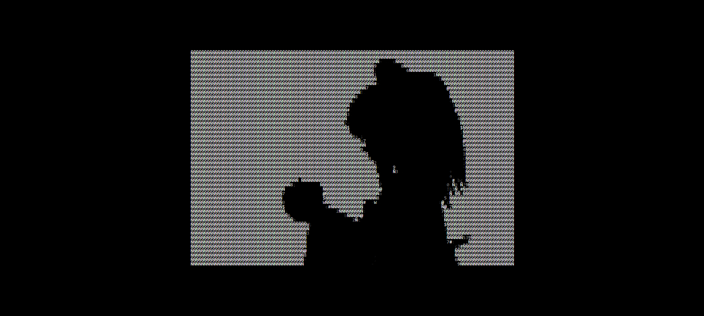

# BAD APPLE ASCII CODE

Projeto em p5.js que renderiza Bad Apple em codigo ASCII. Convertendo cada frame do vídeo e mapeando pixel por pixel.

🔗 Acesse a [demo](https://imoutofbounds.github.io/Bad-Apple-ASCII/) aqui

✨ Tecnologias
- p5.js
- HTML
- CSS
- JS
